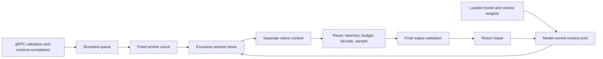

# Architecture

`llama-runtime` is a single-model gRPC inference runtime with four layers:

1. Native adapter (`native/`): wraps `llama.cpp` behind a small C ABI.
2. Managed native wrapper (`LlamaRuntime.Native`): owns native loading, handle translation, and error mapping.
3. Engine (`LlamaRuntime.Engine`): owns model loading, context pooling, and inference sessions.
4. gRPC host (`LlamaRuntime.Presentation.Grpc`): owns startup/shutdown, model state, request queueing, auth, and health checks.

## Ownership and lifecycle

One macOS server process shares model weights. Each concurrent request exclusively leases a separate native context, including its KV memory and execution buffers. The model owns one bounded context pool; contexts are created lazily and the startup metadata probe becomes the first reusable context. Context allocation reuse does not preserve inference state or cache prompts.

`IEngineModel` exposes session acquisition and asynchronous disposal. Loaded metadata is mandatory. A session holds its lease until inference or estimation and session disposal have finished. Concurrent session disposal cannot return a context while a native call still uses it.

The native library stays loaded for the process lifetime. Binding initialization loads both release delegates under one lock before publishing success; a failed initialization can retry.

`QueuedInferenceWorker` loads the model, transfers ownership to the DI-managed `HostedModel`, performs warm-up through the prepared-request execution path, starts the configured workers, and coordinates shutdown. `HostedModel` owns the loaded model independently of its synchronized state and capability snapshots. The model owns its context pool; each operation owns its session. Readiness requires successful warm-up. See `IHostedModel` for transfer and cleanup contracts.

Stopping closes queue admission, finishes queued callers, and requests active cancellation. Accepted requests interrupted by stopping receive the existing model-unavailable response. Caller cancellation retains its existing response; closed-queue rejection retains its queue-rejection response. Expected inference errors finish the current caller. Unexpected worker errors also request host shutdown and fault the worker-completion task.

A stop deadline limits the host's wait, not native resource lifetime. Synchronous and asynchronous DI disposal initiate `HostedModel` cleanup without waiting for native execution. The worker awaits the same cleanup after execution ends, or during startup failure. Closing a model rejects new leases, wakes acquisitions, frees idle contexts, and frees active contexts as leases return. Cleanup retains the model until context creation, leases, and context destruction finish. Engine model disposal uses one idempotent cleanup task; a closed pool cannot reopen.

## Concurrency and generation

- `Inference:WorkerCount` bounds workers and native context allocations.
- Requests enter a bounded queue. `Inference:AcquireTimeout` limits queue admission waiting.
- Cancellation finishes a waiting caller even if its synchronous native operation remains blocked. Native cancellation is cooperative; cleanup waits for execution to return.
- The gRPC service validates policy and compiles an optional JSON schema before admission. One immutable `PreparedGenerationRequest` carries the prompt, resolved options, and compiled constraint through the coordinator and provider. The provider validates final JSON without recompiling the schema.
- Native inference entry clears KV memory, positions, and cancellation state once per generation. Pool acquisition does not reset. Estimation retains an exclusive context lease and reads vocabulary/tokenization data only.
- Native inference tokenizes once, checks prompt tokens plus reserved output against the effective context size, then uses those tokens for prefill. Native budget error `12` preserves the prompt count and maps to the existing actionable error and gRPC trailers.
- One decode helper handles prefill and generated tokens. Only result `0` advances positions; `1` and negative values fail inference; `2` cancels. Cancellation during the final token cannot return success.
- One sampler chain owns the optional grammar sampler, placed before selection stages. Text and JSON use `llama_sampler_sample()`. Greedy selection, top-k 40, top-p, temperature, and native seed semantics remain intact.

See [implementation checks and measurements](isolation-simplification.md) for the verified macOS behavior. Linux build code remains in place; Linux execution is deferred.

## Runtime contract

- Only one model is hosted at a time.
- gRPC is the only serving interface.
- Readiness is healthy only when the model is fully loaded and startup warm-up has completed.
- Prompt budget is enforced before generation using the effective runtime context size minus the request's effective output-token reservation.
- The runtime discovers model metadata, including tokenizer family and training-context metadata, from the loaded model during startup.
- The effective runtime context size comes from the actual created `llama_context` returned by `llama.cpp`, and startup fails if that value does not match the configured runtime context size.
- `GetCapabilities` reports the effective runtime context and the loaded model/runtime pair’s effective features; callers should query it before budgeting requests.
- Native output that exceeds the configured managed buffer fails with a dedicated buffer-too-small error instead of silent truncation.
- `llama.v2` adds capability discovery plus normalized model identity, usage, runtime trace fields, and request-time generation controls. `temperature`, `top_p`, and `max_output_tokens` are validated by the gRPC service and forwarded to native inference; omitted fields use greedy runtime defaults.
- `Llama:Native:GenerationMaxNewTokens` is both the default output-token reservation and the operator ceiling for request-level `generation.max_output_tokens`. Callers can request fewer output tokens, but not more than the configured ceiling or the effective context allows.
- `response_format.type = json` is the runtime's single structured-output mode. Without a schema it enforces an object-root JSON grammar; with `response_format.json_schema` it validates the strict supported schema subset, converts it to GBNF in .NET, and validates the generated object before returning success. Strict object schemas must declare `properties`, `required`, and `additionalProperties: false`, with `required` matching every declared property.
- The native adapter is grammar-only for structured output: it receives either text mode or a ready-made GBNF grammar string and does not parse JSON Schema.

## Compatibility

- The repo is currently pinned to `llama.cpp` release `b10964`.
- Maintainers should change that pin with `make pin-llama LLAMA_VERSION=bNNNN` so the vendored checksum manifest and docs stay aligned.
- The native adapter is intended for the pinned vendor version first; compatibility with other revisions is not guaranteed without validation.
