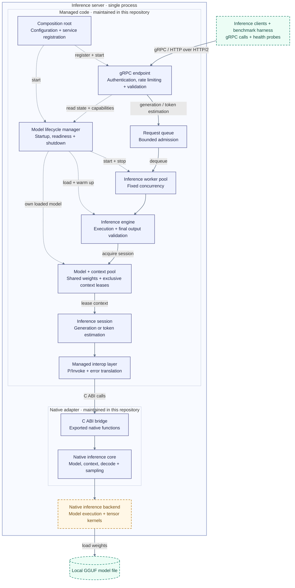
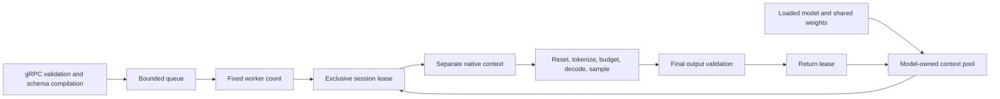

# Architecture

The inference server hosts one GGUF model in one .NET 10 process. gRPC is the serving interface; the native inference backend executes inside the same process. The model is selected at startup and remains resident until shutdown.

## System overview

Solid purple boxes show repository code. The dashed amber box shows upstream native libraries loaded into the server process. Green boxes show clients and the model file outside that process. Solid arrows show calls or data access; dotted arrows show lifecycle wiring, ownership, and state queries. Project references are described below.

Capability discovery and health checks read hosted state without entering the request queue. The benchmark harness runs as a separate client process and calls either the inference server or a separate REST baseline server.

## Layers and dependencies

The runtime has four layers:

1. Native adapter (`native/`): wraps `llama.cpp` behind a small C ABI.
2. Managed native wrapper (`LlamaRuntime.Native`): owns native loading, handle translation, and error mapping.
3. Engine (`LlamaRuntime.Engine`): owns model loading, context pooling, and inference sessions.
4. gRPC host (`LlamaRuntime.Presentation.Grpc`): owns startup/shutdown, model state, request queueing, auth, and health checks.

The native wrapper implements `ILlamaNative` from `LlamaRuntime.Native.Contracts`. The engine consumes that contract and exposes model, session, and generation contracts through `LlamaRuntime.Engine.Contracts`. The host registers the implementations at the composition root and consumes those contracts. Contract projects do not depend on implementation projects; `Engine.Contracts` references `Native.Contracts` for shared native metadata types.

ASP.NET Core and `Grpc.AspNetCore` provide hosting and transport. `Microsoft.Extensions` packages provide configuration, dependency injection, options, and logging. The native adapter links the pinned `llama.cpp` library and ships its GGML backend dependencies. Tests and the benchmark executable run separately from the server.

## Native adapter

| Component | Responsibility |
| --- | --- |
| `native/src/llama_adapter.cpp` and `native/include/llama_adapter.h` | C-compatible declarations, exported functions, generation parameter mapping, and stable integer errors. C++ declarations retain `noexcept`; exceptions must not cross the ABI. |
| `native/src/llama_adapter_core.cpp` and `native/include/llama_adapter_core.h` | Internal C++ model/context ownership, tokenization, explicit batch positions, decoding, sampling, and detokenization. |
| `native/src/llama_adapter_structured_output.cpp` | Creates the optional grammar sampler from a prepared GBNF string. |

The adapter uses the pinned vocabulary, context, batch, and sampler APIs. It fills token and position arrays for prefill and samples through `llama_sampler_sample()`. It does not parse JSON Schema. See the [native README](../native/README.md) for build commands and C API usage.

## Ownership and lifecycle

The server process shares model weights. Each concurrent request exclusively leases a separate native context, including its KV memory and execution buffers. The model owns one bounded context pool; contexts are created lazily and the startup metadata probe becomes the first reusable context. Context allocation reuse does not preserve inference state or cache prompts.

At the C ABI, the caller owns model and context handles and the output buffer. `llama_load_model` pairs with `llama_unload_model`; `llama_create_context` pairs with `llama_remove_context`. A model must outlive every context created from it. The managed wrapper represents those handles with `SafeHandle`; the engine controls when leases and model ownership end. Calls on the same context must be serialized, including destruction. Separate contexts may execute concurrently.

`IEngineModel` exposes session acquisition and asynchronous disposal. Loaded metadata is mandatory. A session holds its lease until inference or estimation and session disposal have finished. Concurrent session disposal cannot return a context while a native call still uses it.

The native library stays loaded for the process lifetime. Binding initialization loads both release delegates under one lock before publishing success; a failed initialization can retry.

Hosted state transitions use `NotLoaded`, `Loading`, `WarmingUp`, `Loaded`, `Failed`, and `Stopping`. Startup publishes `Loaded` only after warm-up succeeds. A failed startup publishes `Failed`; normal shutdown publishes `Stopping` before closing admission and resets the snapshot to `NotLoaded` after cleanup. Resetting the snapshot does not reopen model ownership.

`QueuedInferenceWorker` loads the model, transfers ownership to the DI-managed `HostedModel`, performs warm-up through the prepared-request execution path, starts the configured workers, and coordinates shutdown. `HostedModel` owns the loaded model independently of its synchronized state and capability snapshots. The model owns its context pool; each operation owns its session. Readiness requires successful warm-up. See `IHostedModel` for transfer and cleanup contracts.

Stopping closes queue admission, finishes queued callers, and requests active cancellation. Accepted requests interrupted by stopping receive the existing model-unavailable response. Caller cancellation retains its existing response; closed-queue rejection retains its queue-rejection response. Expected inference errors finish the current caller. Unexpected worker errors also request host shutdown and fault the worker-completion task.

A stop deadline limits the host's wait, not native resource lifetime. Synchronous and asynchronous DI disposal initiate `HostedModel` cleanup without waiting for native execution. The worker awaits the same cleanup after execution ends, or during startup failure. Closing a model rejects new leases, wakes acquisitions, frees idle contexts, and frees active contexts as leases return. Cleanup retains the model until context creation, leases, and context destruction finish. Engine model disposal uses one idempotent cleanup task; a closed pool cannot reopen.

## Concurrency and generation

- `Inference:WorkerCount` bounds workers and native context allocations.
- Requests enter a bounded queue. `Inference:AcquireTimeout` limits queue admission waiting.
- Cancellation finishes a waiting caller even if its synchronous native operation remains blocked. Native cancellation is cooperative; cleanup waits for execution to return.
- The gRPC service validates policy and compiles an optional JSON schema before admission. One immutable `PreparedGenerationRequest` carries the prompt, resolved options, and compiled constraint through the coordinator and provider. The provider validates final JSON without recompiling the schema.
- Native inference entry clears KV memory, positions, and cancellation state once per generation. Pool acquisition does not reset. Estimation retains an exclusive context lease and reads vocabulary/tokenization data only.
- Native inference tokenizes once, checks prompt tokens plus reserved output against the effective context size, then uses those tokens for prefill. Native budget error `12` preserves the prompt count and maps to the existing actionable error and gRPC trailers.
- One decode helper handles prefill and generated tokens. Only result `0` advances positions; `1` and negative values fail inference; `2` cancels. Cancellation during the final token cannot return success.
- One sampler chain owns the optional grammar sampler, placed before selection stages. Text and JSON use `llama_sampler_sample()`. Greedy selection, top-k 40, top-p, temperature, and native seed semantics remain intact.

Linux build code remains in place; Linux execution is deferred.

## Runtime contract

- Only one model is hosted at a time.
- gRPC is the only serving interface.
- Readiness is healthy only when the model is fully loaded and startup warm-up has completed.
- Prompt budget is enforced before generation using the effective runtime context size minus the request's effective output-token reservation.
- The runtime discovers model metadata, including tokenizer family and training-context metadata, from the loaded model during startup.
- The effective runtime context size comes from the actual created `llama_context` returned by `llama.cpp`.
- `GetCapabilities` reports the effective runtime context and the loaded model/runtime pair's effective features; callers should query it before budgeting requests.
- Native output that exceeds the configured managed buffer fails with a dedicated buffer-too-small error instead of silent truncation.
- `llama.v2` adds capability discovery plus normalized model identity, usage, runtime trace fields, and request-time generation controls. `temperature`, `top_p`, and `max_output_tokens` are validated by the gRPC service and forwarded to native inference; omitted fields use greedy runtime defaults.
- Both generation and estimation reject blank prompts and embedded NUL characters before queue admission. This prevents null-terminated native strings from silently dropping a prompt suffix.

### Generation controls

Generation defaults to greedy decoding with `temperature=0`, `top_p=1`, and the configured `Llama:Native:GenerationMaxNewTokens`. Requests may lower `generation.max_output_tokens`, but cannot exceed that operator ceiling or reach the effective context size. `temperature` must be finite and non-negative; `top_p` must be finite, greater than zero, and at most one. A non-default `top_p` requires `temperature > 0`.

### Structured output

`response_format.type = json` is the runtime's single structured-output mode. Omit the schema, pass an empty string, or pass `{}` to require any JSON object. With `response_format.json_schema`, the managed code validates the supported schema subset, compiles it to GBNF before admission, and validates the generated object before returning success.

Schemas support root and nested objects, arrays, strings, numbers, integers, booleans, null, and string enums. The root must be an object. Every object must declare `properties`, `required`, and `additionalProperties: false`, with `required` matching every declared property. Unsupported schema keywords are rejected. The native adapter receives text mode or a ready-made GBNF grammar string; it does not parse JSON Schema.

## Configuration and health

The Makefile loads `.env` or the selected platform environment file for local commands. The executable itself reads standard .NET configuration and environment variables. See the [README configuration table](../README.md#configuration) for names and defaults.

Startup validates native settings: context size `1..65536`, batch size `1..4096` and no larger than context size, output tokens `1..16384` and less than context size, buffer size `1..16777216` bytes. The effective context size from the created native context must match the configured size.

See [concurrency and generation](#concurrency-and-generation) for worker limits, queue admission timeouts, and cooperative cancellation.

`/health/ready` checks for the `Loaded` state after model loading and warm-up. `/health/live` checks the HTTP host without inspecting model readiness. Both endpoints pass through the global rate limiter. Authenticated requests use the validated API-key identity as their rate-limit partition; unauthenticated requests share the anonymous partition.

Operational logs exclude prompts and generated content. The separate benchmark harness may write both to its invocation JSONL files; see [benchmark logging](benchmarking.md#4-output--logging).

## Packaging

`make pack` publishes the gRPC host as a self-contained single-file executable, then copies the native adapter, upstream shared libraries, and license files into `dist/`. Native dependencies remain alongside the executable and load from the configured library path.

Keep `PublishReadyToRun` disabled by default. Enabling it caused a reproducible .NET 10 startup crash while loading the native libraries. `PUBLISH_READY_TO_RUN=true make pack` is available for investigation.

## Scope

Model loading, inference, token estimation, structured output, and capability/usage reporting belong to the runtime. Conversation state, model routing, context reduction, prompt templating policy, tool execution, and agent loops belong to its callers. Requests target the model selected at startup; there is no request-level model selector or multi-model hosting.

Speculative decoding is not implemented. Capability replies and runtime traces report it as unavailable. The [backlog](backlog.md) tracks planned changes.

## Compatibility

- Runtime and native integration behavior are validated on macOS Apple Silicon. Linux x64 and arm64 build targets remain available, but Linux execution is unverified. The release workflow currently publishes only the macOS arm64 package.
- The repo is currently pinned to `llama.cpp` release `b10964`.
- Maintainers should change that pin with `make pin-llama LLAMA_VERSION=bNNNN` so the vendored checksum manifest and docs stay aligned.
- The native adapter is intended for the pinned vendor version first; compatibility with other revisions is not guaranteed without validation.
